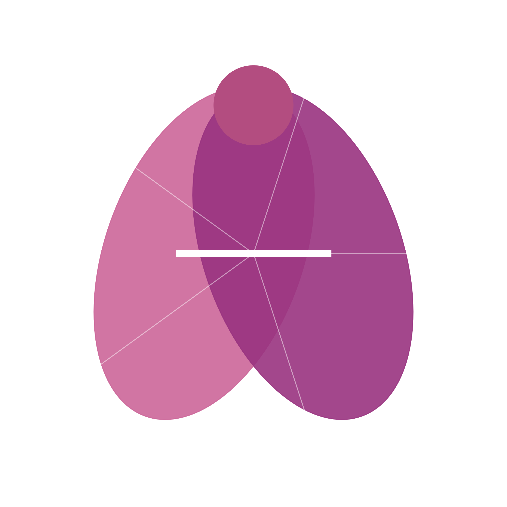

# 🍑 Anus: Autonomous Networked Utility System

<p align="center">
  
</p>

<p align="center">
  <a href="https://github.com/nikmcfly/ANUS/blob/main/LICENSE"></a>
  <a href="https://www.python.org/downloads/"></a>
  <a href="https://github.com/psf/black"></a>
  <a href="https://github.com/nikmcfly/ANUS/blob/main/CONTRIBUTING.md"></a>
  <br>
  <a href="https://github.com/nikmcfly/ANUS/stargazers"></a>
  <a href="https://github.com/nikmcfly/ANUS/network/members"></a>
  <a href="https://github.com/nikmcfly/ANUS/issues"></a>
  <a href="https://makeapullrequest.com"></a>
  <a href="https://anus-ai.github.io/docs"></a>
  <a href="https://t.me/goanus"></a>
</p>

## Table of Contents

- [Introduction](#-introduction)
- [Why Anus?](#-why-anus)
- [Features & Capabilities](#-features--capabilities)
- [Installation](#-installation)
- [Quick Start](#-quick-start)
- [Usage Examples](#-usage-examples)
- [Documentation](#-documentation)
- [Contributing](#-contributing)
- [Community](#-community)
- [License](#-license)

## 🌟 Introduction

**Anus** (Autonomous Networked Utility System) is a powerful, flexible, and accessible open-source AI agent framework designed to revolutionize task automation. Built with modern AI technologies and best practices, Anus represents the next generation of AI agent frameworks, offering unparalleled capabilities and ease of use.

Anus empowers users to create AI agents that can:
- Execute complex tasks through natural language instructions
- Collaborate in multi-agent environments to solve problems
- Interact with web services, documents, and code
- Process multimodal inputs including text, images, and audio
- Adapt to different domains and use cases

Whether you're a developer looking to build AI-powered applications, a researcher exploring agent-based systems, or an enthusiast interested in the latest AI technologies, Anus provides the tools and flexibility you need to succeed.

## 💡 Why Anus?

- **Truly Open Source**: No barriers, no invite codes, just pure open-source goodness
- **Hybrid Architecture**: Combines single-agent simplicity with multi-agent power
- **Flexible Model Support**: Works with OpenAI models, open-source models, or your own
- **Comprehensive Tool Ecosystem**: Web automation, document processing, code execution, and more
- **Community-First Design**: Built for contributions and extensions
- **Transparent Operation**: Clear explanations of all agent actions and decisions
- **Cross-Platform**: Works across different operating systems and environments

## ✨ Features & Capabilities

### 🧠 Advanced AI Agent Architecture

- **Hybrid Agent System**: Seamlessly switch between single-agent and multi-agent modes based on task complexity
- **Dynamic Task Planning**: Sophisticated planning system that breaks down complex tasks into manageable steps
- **Adaptive Resource Allocation**: Intelligently allocates computational resources based on task requirements
- **Memory Management**: Short-term and long-term memory systems for context retention across conversations
- **Explainable Actions**: Transparent reasoning and decision-making processes

### 🤝 Multi-Agent Collaboration

- **Specialized Agent Roles**: Pre-defined roles like Researcher, Coder, Planner, and more
- **Custom Role Creation**: Define your own agent roles with specific capabilities and knowledge
- **Inter-Agent Communication**: Structured protocols for efficient agent-to-agent communication
- **Consensus Mechanisms**: Collaborative decision-making through agent voting and consensus
- **Conflict Resolution**: Sophisticated protocols for resolving disagreements between agents

### 🛠️ Comprehensive Tool Ecosystem

- **Web Interaction**:
  - Full browser automation via Playwright
  - Web scraping and data extraction
  - Form filling and submission
  - Authentication handling

- **Information Retrieval**:
  - Search engine integration
  - Wikipedia access
  - News and current events sources
  - Specialized knowledge bases

- **Document Processing**:
  - PDF parsing and analysis
  - Office document handling (Word, Excel, PowerPoint)
  - Image recognition and OCR
  - Data extraction and transformation

- **Code Execution**:
  - Secure Python execution sandbox
  - Multiple language support
  - Package management
  - Output capture and analysis

- **Multimodal Processing**:
  - Image analysis and generation
  - Audio processing and transcription
  - Video analysis and summarization
  - Chart and graph interpretation

### 🔄 Flexible Model Integration

- **OpenAI API Support**: Seamless integration with GPT-4 and newer models
- **Open-Source Models**: Support for Llama, Mistral, and other open-source models
- **Local Deployment**: Run models locally for privacy and reduced costs
- **Model Switching**: Automatically select the appropriate model based on task requirements
- **Fallback Mechanisms**: Gracefully handle API issues by switching to alternative models

### 👥 User-Friendly Interfaces

- **Command-Line Interface**: Simple and intuitive commands for terminal users
- **Web Interface**: Optional browser-based dashboard for visual interaction
- **API Integration**: RESTful API for embedding Anus in other applications
- **Conversation History**: Review and continue previous conversations
- **Task Monitoring**: Track progress of long-running tasks

### 🔒 Privacy and Security

- **Local Execution**: Process sensitive data locally without sending to external APIs
- **API Key Management**: Secure handling of API keys and credentials
- **Permission System**: Fine-grained control over agent capabilities
- **Audit Logging**: Comprehensive logging of all agent actions
- **Sandboxed Execution**: Secure environment for running untrusted code

### 🧩 Extensibility

- **Plugin System**: Easily extend functionality with custom plugins
- **Custom Tools**: Create your own tools to expand agent capabilities
- **Model Adapters**: Add support for new AI models
- **Middleware**: Insert custom processing steps in the agent workflow
- **Event Hooks**: React to specific events in the agent lifecycle

## 🔧 Installation

Anus AI supports multiple installation methods to accommodate different user preferences and environments.

### Prerequisites

- Python 3.11 or higher
- pip (Python package installer)
- Git

### Method 1: Pip Installation (Recommended for Users)

```bash
# Install from PyPI
pip install anus-ai

# Verify installation
anus --version
```

### Method 2: From Source (Recommended for Developers)

```bash
# Clone the repository
git clone https://github.com/nikmcfly/ANUS.git
cd ANUS

# Create and activate a virtual environment
python -m venv venv
source venv/bin/activate  # On Windows: venv\Scripts\activate

# Install in development mode
pip install -e .

# Verify installation
anus --version
```

### Method 3: Using Docker

```bash
# Pull the Docker image
docker pull anusai/anus:latest

# Run Anus in a container
docker run -it anusai/anus:latest
```

### Method 4: Using Conda

```bash
# Create a new conda environment
conda create -n anus python=3.11
conda activate anus

# Install Anus
pip install anus-ai
```

### Platform-Specific Instructions

#### Windows

```bash
# Install required system dependencies
pip install windows-curses

# If using browser automation
playwright install
```

#### macOS

```bash
# Install required system dependencies
brew install python@3.11

# If using browser automation
playwright install
```

#### Linux

```bash
# Install required system dependencies
sudo apt-get update
sudo apt-get install -y python3.11 python3.11-venv

# If using browser automation
playwright install
```

### Optional Dependencies

Anus has several optional features that require additional dependencies:

```bash
# For document processing
pip install anus-ai[documents]

# For browser automation
pip install anus-ai[browser]

# For code execution
pip install anus-ai[code]

# For all optional features
pip install anus-ai[all]
```

### Configuration

After installation, you'll need to configure Anus with your API keys:

1. Create a configuration file:

```bash
anus init
```

2. Edit the generated `.anus/config.yaml` file with your API keys:

```yaml
llm:
  provider: openai
  api_key: your_openai_api_key
  model: gpt-4o

# Optional: Configure other providers
anthropic:
  api_key: your_anthropic_api_key

# Optional: Configure tool-specific settings
browser:
  headless: true
```

## 🚀 Quick Start

Once installed, you can start using Anus right away:

```bash
# Run Anus with a simple task
anus run "Find the latest news about artificial intelligence"

# Run in interactive mode
anus interactive

# Run with a specific configuration file
anus run --config custom_config.yaml "Summarize this article: https://example.com/article"
```

## 📋 Usage Examples

### Basic Examples

#### Simple Question Answering

```python
from anus import Agent

# Create a single agent
agent = Agent()

# Ask a simple question
response = agent.run("What is the capital of France?")
print(response)
```

#### Web Search

```python
from anus import Agent
from anus.tools import SearchTool

# Create an agent with search capabilities
agent = Agent(tools=[SearchTool()])

# Search for information
response = agent.run("Find the latest research on quantum computing")
print(response)
```

#### Document Analysis

```python
from anus import Agent
from anus.tools import DocumentTool

# Create an agent with document processing capabilities
agent = Agent(tools=[DocumentTool()])

# Analyze a PDF document
response = agent.run("Summarize this PDF: /path/to/document.pdf")
print(response)
```

### Advanced Examples

#### Multi-Agent Collaboration

```python
from anus import Society, Agent

# Create specialized agents
researcher = Agent(role="researcher")
analyst = Agent(role="analyst")
writer = Agent(role="writer")

# Create a society of agents
society = Society(agents=[researcher, analyst, writer])

# Execute a complex task with collaboration
response = society.run(
    "Research the impact of artificial intelligence on healthcare, " 
    "analyze the findings, and write a comprehensive report"
)
print(response)
```

#### Browser Automation

```python
from anus import Agent
from anus.tools import BrowserTool

# Create an agent with browser capabilities
agent = Agent(tools=[BrowserTool()])

# Perform a web task
response = agent.run(
    "Go to weather.com, check the weather forecast for New York City for the next 5 days, "
    "and create a summary table"
)
print(response)
```

#### Code Generation and Execution

```python
from anus import Agent
from anus.tools import CodeTool

# Create an agent with code execution capabilities
agent = Agent(tools=[CodeTool()])

# Generate and execute code
response = agent.run(
    "Create a Python script that generates a fractal tree visualization using matplotlib"
)
print(response)
```

### Command-Line Interface Examples

#### Running Tasks

```bash
# Simple information retrieval
anus run "What is the population of Tokyo?"

# Web search with specific parameters
anus run --search-depth=3 "Find recent breakthroughs in fusion energy research"

# Document processing
anus run --file=/path/to/report.pdf "Extract all financial data from this report"
```

#### Interactive Mode

```bash
# Start interactive session
anus interactive

# In interactive mode, you can have a conversation:
# > Tell me about the history of artificial intelligence
# > Now create a timeline of major AI milestones
# > Generate a visualization of this timeline
```

#### Multi-Agent Mode

```bash
# Run a complex task with multiple agents
anus run --mode=multi "Research, analyze, and summarize the current state of renewable energy technologies"

# Specify particular agent roles
anus run --mode=multi --roles=researcher,analyst,writer "Create a comprehensive market analysis for electric vehicles"
```

### API Usage

```python
from anus.api import AnusAPI

# Initialize the API client
api = AnusAPI(api_key="your_api_key")

# Send a request
response = api.process_task(
    task="Generate a business plan for a sustainable fashion startup",
    mode="multi",
    output_format="markdown"
)

# Print or save the response
print(response.result)
with open("business_plan.md", "w") as f:
    f.write(response.result)
```

### Advanced Configuration

```python
from anus import Agent, Config

# Create a custom configuration
config = Config(
    llm={
        "provider": "anthropic",
        "model": "claude-3-opus",
        "temperature": 0.7,
    },
    memory={
        "type": "persistent",
        "path": "./agent_memory",
    },
    tools={
        "browser": {"headless": False},
        "code": {"sandbox": True},
    }
)

# Create an agent with custom configuration
agent = Agent(config=config)

# Run a task
response = agent.run("Create an interactive data visualization for climate change data")
print(response)
```

## 📚 Documentation

For detailed documentation, visit our [Documentation Site](https://anus-ai.github.io/docs).

- [Installation Guide](https://anus-ai.github.io/docs/installation)
- [Getting Started](https://anus-ai.github.io/docs/getting-started)
- [Architecture Overview](https://anus-ai.github.io/docs/architecture)
- [API Reference](https://anus-ai.github.io/docs/api)
- [Examples](https://anus-ai.github.io/docs/examples)
- [Contributing Guide](https://anus-ai.github.io/docs/contributing)

## 👥 Contributing

We welcome contributions from the community! Anus is designed to be community-driven, and your input helps make it better for everyone.

### Ways to Contribute

- **Code Contributions**: Implement new features, fix bugs, or improve performance
- **Documentation**: Improve or expand documentation, add examples, fix typos
- **Bug Reports**: Report bugs or suggest improvements
- **Feature Requests**: Suggest new features or enhancements
- **Community Support**: Help answer questions and support other users

### Getting Started with Contributing

1. **Fork the Repository**

```bash
# Fork the repository on GitHub, then clone your fork
git clone https://github.com/your-username/anus.git
cd anus
```

2. **Set Up Development Environment**

```bash
# Create and activate a virtual environment
python -m venv venv
source venv/bin/activate  # On Windows: venv\Scripts\activate

# Install development dependencies
pip install -e ".[dev]"
```

3. **Create a Branch**

```bash
# Create a branch for your contribution
git checkout -b feature/your-feature-name
```

4. **Make Your Changes**

- Follow the code style guidelines
- Add tests for new functionality
- Update documentation as needed

5. **Run Tests**

```bash
# Run the test suite
pytest

# Run linting
flake8
mypy anus
```

6. **Submit a Pull Request**

- Push your changes to your fork
- Submit a pull request from your branch to our main branch
- Provide a clear description of the changes and any related issues

### Code Style Guidelines

- Follow [PEP 8](https://pep8.org/) for Python code style
- Use type hints for all function parameters and return values
- Write docstrings for all functions, classes, and modules
- Keep functions focused and small (under 50 lines when possible)
- Use meaningful variable and function names

### Commit Message Guidelines

We follow the [Conventional Commits](https://www.conventionalcommits.org/) specification:

```
<type>(<scope>): <description>

[optional body]

[optional footer(s)]
```

Types include:
- `feat`: A new feature
- `fix`: A bug fix
- `docs`: Documentation changes
- `style`: Code style changes (formatting, etc.)
- `refactor`: Code changes that neither fix bugs nor add features
- `test`: Adding or modifying tests
- `chore`: Changes to the build process or auxiliary tools

### Pull Request Process

1. Update the README.md or documentation with details of changes if appropriate
2. Update the CHANGELOG.md with details of changes
3. The PR should work for Python 3.11 and above
4. PRs require approval from at least one maintainer
5. Once approved, a maintainer will merge your PR

### Code of Conduct

Please note that this project is released with a [Contributor Code of Conduct](CODE_OF_CONDUCT.md). By participating in this project you agree to abide by its terms.

## 🌐 Community

Join our community to get help, share ideas, and contribute to the project:

- [Telegram Channel](https://t.me/goanus)

## 📝 License

Anus is released under the [MIT License](LICENSE).

```
MIT License

Copyright (c) 2025 Anus AI Team

Permission is hereby granted, free of charge, to any person obtaining a copy
of this software and associated documentation files (the "Software"), to deal
in the Software without restriction, including without limitation the rights
to use, copy, modify, merge, publish, distribute, sublicense, and/or sell
copies of the Software, and to permit persons to whom the Software is
furnished to do so, subject to the following conditions:

The above copyright notice and this permission notice shall be included in all
copies or substantial portions of the Software.

THE SOFTWARE IS PROVIDED "AS IS", WITHOUT WARRANTY OF ANY KIND, EXPRESS OR
IMPLIED, INCLUDING BUT NOT LIMITED TO THE WARRANTIES OF MERCHANTABILITY,
FITNESS FOR A PARTICULAR PURPOSE AND NONINFRINGEMENT. IN NO EVENT SHALL THE
AUTHORS OR COPYRIGHT HOLDERS BE LIABLE FOR ANY CLAIM, DAMAGES OR OTHER
LIABILITY, WHETHER IN AN ACTION OF CONTRACT, TORT OR OTHERWISE, ARISING FROM,
OUT OF OR IN CONNECTION WITH THE SOFTWARE OR THE USE OR OTHER DEALINGS IN THE
SOFTWARE.
```
